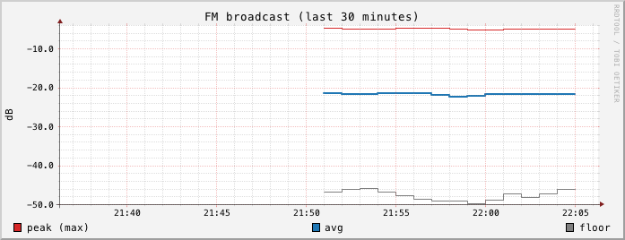
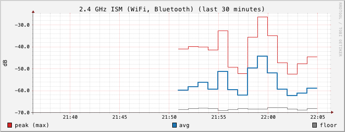

# rfmon

rfmon is a spectrum monitor for the [HackRF One](https://greatscottgadgets.com/hackrf/one/)
software-defined radio. It sweeps 1 MHz to 6 GHz about once a minute, keeps
per-band statistics in RRDtool files with MRTG-style rollups, stores a
compact full-spectrum snapshot of every sweep for 7 days, and serves graphs
from a built-in web server.

It is for people who own a HackRF and want a long-running record of what RF
energy is present where they are: radio hobbyists, people checking for new
or intermittent transmitters, and anyone curious how busy the local bands are
over a day, a week, or a year.



FM broadcast band (88 to 108 MHz) over the first 15 polls of a run: peak
(red), average (blue), and noise floor (gray), in uncalibrated dB. The graph
was rendered with `rrdtool` from rfmon's RRD file using the same line styles
as the web UI.

## Features

- Full 1 MHz to 6 GHz sweep per poll, using `hackrf_sweep`.
- Per-bin median across several passes to suppress one-pass outliers.
- Rejects incomplete sweeps, so a USB error mid-sweep does not record bad data.
- Removes the HackRF / USB self-interference spurs at multiples of 20 MHz.
- 43 US frequency bands, each with average power, peak, noise floor, and
  occupancy.
- One RRD file per band: 1-minute data for 2 days, 5-minute for 14 days,
  30-minute for 62 days, 2-hour for 2 years. Files never grow.
- Daily gzip files with every sweep's full spectrum, pruned after 7 days.
- Web UI on 127.0.0.1:8080 with an index of all bands and day, week, month,
  and year graphs per band.
- A single Go binary with no cgo. It calls the `hackrf_sweep` and
  `rrdtool` command-line tools.

## Requirements

Hardware:

- HackRF One. Tested with firmware 2026.01.3. Older firmware may work but has
  not been tested.
- An antenna suited to the range you care about. A single antenna will not
  perform equally across 1 MHz to 6 GHz.

Software (versions rfmon was tested with):

| Software | Tested version |
|---|---|
| Go | 1.26 |
| hackrf tools (`hackrf_sweep`) | 2026.01.3 |
| RRDtool (`rrdtool`) | 1.11.0 |

rfmon was developed and tested on macOS (Apple silicon) with Homebrew. The
code has no macOS-specific parts, so it should build on Linux with the same
tools installed, but that has not been tested.

## Install

Install the tools rfmon runs:

```sh
brew install hackrf rrdtool
```

Then install rfmon with Go:

```sh
go install github.com/jbrahy/rfmon/cmd/rfmon@latest
```

This puts the `rfmon` binary in `$(go env GOPATH)/bin`.

Or build from source:

```sh
git clone https://github.com/jbrahy/rfmon.git
cd rfmon
go build -o rfmon ./cmd/rfmon
```

## Quick start

1. Plug in the HackRF and close any other software that is using it.
2. Start rfmon in the directory where you want its data:

   ```sh
   rfmon
   ```

   It logs where the graphs and data are, then one line per poll:

   ```
   2026/09/12 21:50:52 rfmon: graphs at http://127.0.0.1:8080, data in ./data
   2026/09/12 21:50:57 poll ok: 25200 bins, 43 bands, 4.875s
   ```

3. Open http://127.0.0.1:8080 in a browser. Graphs fill in as polls
   accumulate. A day graph spans 24 hours in 600 pixels, so the first few
   polls show up only as a short segment at its right edge.

## Flags

| Flag | Default | Meaning |
|---|---|---|
| `-data` | `./data` | Directory for RRD and spectrum files. Created if missing. |
| `-listen` | `127.0.0.1:8080` | Address for the web server. |
| `-pause` | `60s` | Pause between the end of one poll and the start of the next. Any Go duration (`30s`, `2m`). |
| `-passes` | `5` | `hackrf_sweep` passes per poll. The per-bin median is taken across them. |

A sweep that runs longer than 2 minutes is stopped and the poll discarded,
which limits how high `-passes` can go. Keep poll time plus `-pause` under
180 seconds. The RRD heartbeat is 180 s,
and a longer gap between updates is recorded as unknown.

The `-data` path must not contain `:`, because rrdtool uses `:` as a field
separator in graph definitions.

## Web UI

| Route | Content |
|---|---|
| `GET /` | Every band with its day graph. |
| `GET /band/<slug>` | Day, week, month, and year graphs for one band. |
| `GET /graph/<slug>-<period>.png` | One graph PNG. `<period>` is `day`, `week`, `month`, or `year`. |

Graphs plot the band's average, peak (MAX consolidation), and noise floor in
dB.



Bands with bursty traffic, such as 2.4 GHz ISM (WiFi, Bluetooth), move from
poll to poll, while the FM broadcast band above stays nearly flat.
 Rendered PNGs are cached in memory for 60 seconds. Band slugs are listed
in [docs/bands.md](docs/bands.md).

## Stopping rfmon

Press Ctrl-C, or send SIGTERM. rfmon stops a running sweep with SIGINT so
`hackrf_sweep` can release the device cleanly, shuts down the web server, and
logs `rfmon: stopped`.

rfmon needs exclusive use of the HackRF. It opens the device for every
sweep and starts a new sweep after each pause, so `hackrf_info`,
`hackrf_transfer`, and other SDR software cannot use it reliably until rfmon
is stopped.

## Disk use

Measured on a live system:

| Data | Size |
|---|---|
| `data/rrd/` (43 RRD files) | about 51 MB, fixed. RRD files are allocated at full size when created. |
| `data/spectrum/` | about 17 KB per poll, roughly 20 to 25 MB per day, about 170 MB once 7 days are kept. |

## How it works

Each poll runs:

```sh
hackrf_sweep -f 1:6000 -w 250000 -l 32 -g 20 -N 5
```

rfmon parses the CSV output, takes the median power of each frequency bin
across the passes, and discards the poll unless it has exactly 25200 bins.
It then marks bins within 250 kHz of any multiple of 20 MHz as no-data,
computes metrics for each of the 43 bands, writes them to that band's RRD
file, appends the full spectrum to the current UTC day's snapshot file,
deletes snapshot files older than 7 days, pauses, and repeats.

A 5-pass poll takes about 4.9 s on an Apple M3 Pro with the HackRF behind a
USB-C hub, so with the default pause a full cycle is about 65 s.

Band metrics:

| Metric | Definition |
|---|---|
| `avg` | Mean of bin powers in linear terms, converted back to dB. |
| `peak` | Highest bin. |
| `floor` | 10th percentile bin. |
| `occ` | Percent of bins at or above `floor + 10 dB`. |

All dB values are the uncalibrated power scale reported by `hackrf_sweep`,
not dBm.

## WiFi and Bluetooth

Unless started with `-spectrum-only`, rfmon also time-slices the same
HackRF to decode WiFi management frames and Bluetooth LE advertisements,
alongside the spectrum sweep. It captures:

- WiFi beacon and probe response frames on channels 1, 6, and 11 (802.11
  OFDM only, decoded with GNU Radio's `gr-ieee802-11`), giving access point
  SSID, channel, security, and whether the source MAC looks randomized.
- Bluetooth LE advertisements across the primary advertising channels,
  captured with `ice9-bluetooth` (from `ice9-bluetooth-sniffer`), giving
  device address, address type, advertised name (when present), and
  manufacturer company ID.

### Dwell cycle

rfmon cycles through WiFi channel 1, channel 6, channel 11, then a BLE
dwell, then either a spectrum sweep (if `-sweep-every` has elapsed since the
last one) or a pause, and repeats. Each WiFi and BLE dwell runs for
`-dwell` (default 3s); `-pause` (default 5s) separates cycles that do not
include a sweep. On a live run with the default flags, one cycle without a
sweep measured about 17 seconds; a cycle that also runs a spectrum sweep
measured about 74 to 80 seconds. Every dwell and sweep is recorded with a
status, so a failed WiFi or BLE dwell does not stop the cycle.

### Installing the decoders

WiFi and Bluetooth decoding need three pieces of software beyond the
`hackrf`/`rrdtool` tools: the GNU Radio out-of-tree modules `gr-foo` and
`gr-ieee802-11` (imported by the OFDM decoder script), and the
`ice9-bluetooth` binary from `ice9-bluetooth-sniffer`. Build and install all
three with:

```sh
scripts/install-decoders.sh
```

This clones each project at a pinned commit, builds it, and installs it
into `$HOME/.local/share/rfmon/decoders` (override with `RFMON_DECODERS`).
It requires Homebrew and no `sudo`, and is safe to re-run. It ends by
running the same import check and `-h` check rfmon itself uses to verify
the install, and prints the `-decoders`/`-gr-python` flags to pass to
rfmon.

`ice9-bluetooth` is invoked by its bare name, not by its full install path,
so its directory (`$RFMON_DECODERS/bin`, or `$HOME/.local/share/rfmon/decoders/bin`
by default) needs to be on `PATH` when rfmon runs, in addition to passing
`-decoders`.

### New flags

| Flag | Default | Meaning |
|---|---|---|
| `-dwell` | `3s` | Length of each WiFi and BLE dwell. |
| `-sweep-every` | `60s` | Minimum time between spectrum sweeps once WiFi/BLE dwells are running. |
| `-decoders` | `$HOME/.local/share/rfmon/decoders` | Decoder install prefix from `scripts/install-decoders.sh`. |
| `-gr-python` | `/opt/homebrew/opt/gnuradio/libexec/venv/bin/python` | GNU Radio's Python interpreter, used to run the OFDM decoder script. |
| `-decoder-script` | `decoders/wifi_ofdm_rx.py` | Path to the OFDM decoder script. Resolved relative to the working directory, so run rfmon from the repo root or pass an absolute path. |
| `-spectrum-only` | `false` | Run only the spectrum sweep, with no WiFi or BLE decoding and no decoder tools required. |

`-pause` (see the main Flags table) still controls the gap between cycles
that do not include a sweep.

### Web pages

| Route | Content |
|---|---|
| `GET /wifi` | WiFi access points and clients seen, with last-seen time and signal. |
| `GET /bluetooth` | BLE devices seen, with last-seen time and signal. |

Both pages also have day/week/month/year count graphs, served the same way
as the band graphs (`GET /graph/<slug>-<period>.png`).

### Database

WiFi and BLE data is stored in a SQLite database at `data/rfmon.db`
(alongside the RRD and spectrum files under `-data`). Summary of the
schema:

- `dwells`: one row per WiFi, BLE, or sweep attempt, with `dwell_kind`,
  `status` (`ok` or `failed`), an error message when failed, and a
  frame/packet count.
- `wifi_devices`: one row per (MAC, device kind) seen, with SSID, channel,
  security, whether the MAC looks randomized, first/last seen, sighting
  count, and best SNR.
- `wifi_sightings`: per-dwell WiFi detail rows behind `wifi_devices`.
- `ble_devices`: one row per (address, address type) seen, with advertised
  name, manufacturer company ID, first/last seen, sighting count, and best
  RSSI.
- `ble_sightings`: per-dwell BLE detail rows behind `ble_devices`.

### Privacy

WiFi and BLE decoding is passive receive only: rfmon never transmits.
Captured data stays local in the SQLite database under `-data`; nothing is
sent anywhere else. Do not publish SSIDs, MAC addresses, or BLE addresses
captured from a live run; the schema summary and any screenshots or reports
generated from real data should have identifiers removed or replaced first.

The WiFi decoder only handles 802.11 OFDM frames (802.11a/g/n on channels
1, 6, and 11). Older or legacy devices that beacon only at 802.11b DSSS
rates are not decoded, so the WiFi device list will miss some access
points that are visible in the 2.4 GHz spectrum graph.

## Documentation

- [Architecture](docs/architecture.md): packages, the data flow of one poll,
  failure handling, shutdown, and design decisions.
- [Data formats](docs/data-formats.md): RRD layout, the spectrum snapshot
  format, and examples of reading both.
- [Bands](docs/bands.md): all 43 bands and how metrics are defined.
- [Operations](docs/operations.md): running unattended with launchd, logs,
  disk use, and troubleshooting.

## Development

```sh
go vet ./...
go test ./...
```

The `internal/rrd` tests run the real `rrdtool` binary and are skipped when
it is not installed. The `internal/sweep` parser test uses
`internal/sweep/testdata/sweep_88_128.csv`, a real `hackrf_sweep` capture of
88 to 128 MHz. The poll and runner tests use small shell scripts in the same
directory in place of `hackrf_sweep`, so no HackRF is needed to run the test
suite.

## License

MIT. See [LICENSE](LICENSE).
