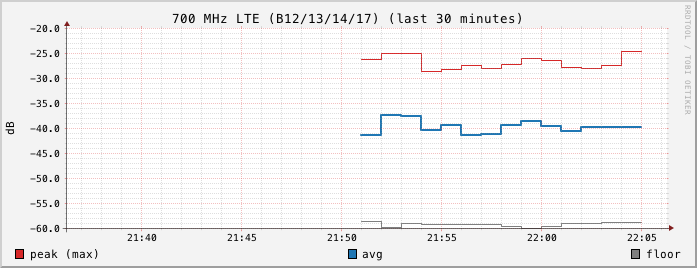

# Bands

rfmon tracks 43 frequency bands. The table below is generated from
`internal/bands/bands.go`, which is the source of truth. Each band covers
`[Low MHz, High MHz)`: a bin belongs to the band if its center frequency is at
least the low edge and below the high edge.

The bands follow US frequency allocations. Labels name the main users of each
range in the US and do not apply elsewhere. Some ranges between bands are not
tracked (for example 30 to 54 MHz, 1780 to 1850 MHz, 3980 to 4940 MHz, and
5925 to 6000 MHz), but those frequencies are still recorded in the
[spectrum snapshots](data-formats.md#spectrum-snapshots).

"Bins used" is the number of sweep bins whose centers fall in the band after
the 20 MHz spur filter, for the fixed sweep grid (bins about 238 kHz wide).
Narrow bands have few bins, so their metrics are coarse. `am-broadcast` has
only 3 bins, so its `floor` is its lowest bin and its `occ` can only be
0, 33.3, or 66.7 percent (the floor bin itself can never count).

| Slug | Label | Low MHz | High MHz | Bins used |
|---|---|---:|---:|---:|
| `am-broadcast` | AM broadcast | 1 | 1.7 | 3 |
| `hf` | HF shortwave / ham | 1.8 | 30 | 117 |
| `tv-vhf-low` | VHF TV ch 2-6 | 54 | 88 | 138 |
| `fm-broadcast` | FM broadcast | 88 | 108 | 82 |
| `aviation-vhf` | Aviation VHF | 108 | 137 | 120 |
| `wx-satellite` | Weather satellites | 137 | 138 | 4 |
| `ham-2m` | 2m ham | 144 | 148 | 16 |
| `vhf-land-mobile` | VHF land mobile / public safety | 148 | 174 | 108 |
| `tv-vhf-high` | VHF TV ch 7-13 | 174 | 216 | 172 |
| `mil-aviation` | Military aviation / misc | 216 | 400 | 754 |
| `federal-uhf` | Federal UHF | 400 | 420 | 82 |
| `ham-70cm` | 70cm ham | 420 | 450 | 123 |
| `uhf-land-mobile` | UHF land mobile / GMRS | 450 | 470 | 82 |
| `tv-uhf` | UHF TV ch 14-36 | 470 | 608 | 565 |
| `radio-astronomy` | Radio astronomy | 608 | 614 | 26 |
| `lte-600` | 600 MHz LTE/5G (B71) | 614 | 698 | 344 |
| `lte-700` | 700 MHz LTE (B12/13/14/17) | 698 | 806 | 442 |
| `public-safety-800` | 800 MHz public safety / SMR | 806 | 824 | 74 |
| `cell-uplink` | Cellular uplink (B5) | 824 | 849 | 103 |
| `misc-850` | 800 MHz misc | 849 | 869 | 82 |
| `cell-downlink` | Cellular downlink (B5) | 869 | 894 | 103 |
| `narrowband-900` | 900 MHz narrowband | 894 | 902 | 31 |
| `ism-900` | 900 ISM (LoRa, smart meters) | 902 | 928 | 107 |
| `paging` | Paging / fixed links | 928 | 960 | 132 |
| `aviation-dme` | Aviation (DME, ADS-B) | 960 | 1215 | 1046 |
| `radar-gnss` | Radar / GNSS L2 | 1215 | 1300 | 348 |
| `l-band-misc` | L-band misc | 1300 | 1525 | 922 |
| `sat-l-band` | Satellite L-band / GPS L1 | 1525 | 1660 | 554 |
| `met-sat` | Met satellites | 1660 | 1710 | 205 |
| `aws-uplink` | AWS uplink | 1710 | 1780 | 287 |
| `pcs-uplink` | PCS uplink | 1850 | 1915 | 267 |
| `pcs-downlink` | PCS downlink (B2/25) | 1930 | 1995 | 267 |
| `aws-downlink` | AWS downlink (B4/66) | 2110 | 2200 | 369 |
| `wcs-siriusxm` | WCS / SiriusXM | 2305 | 2360 | 226 |
| `ism-2400` | 2.4 GHz ISM (WiFi, Bluetooth) | 2400 | 2483.5 | 341 |
| `lte-2500` | 2.5 GHz 5G (B41/n41) | 2496 | 2690 | 795 |
| `radar-s-band` | S-band radar | 2700 | 3450 | 3075 |
| `nr-3450` | 3.45 GHz 5G | 3450 | 3550 | 410 |
| `cbrs` | CBRS | 3550 | 3700 | 615 |
| `c-band-5g` | C-band 5G | 3700 | 3980 | 1148 |
| `public-safety-4900` | 4.9 GHz public safety | 4940 | 4990 | 205 |
| `wifi-5g` | 5 GHz WiFi | 5150 | 5895 | 3055 |
| `v2x` | V2X | 5895 | 5925 | 122 |

## Metrics

For every band on every poll, rfmon takes the band's bins from the
median-filtered, spur-filtered spectrum, ignores no-data bins, and computes:

| Metric | Unit | Definition |
|---|---|---|
| `avg` | dB | Convert each bin to linear power (`10^(dB/10)`), take the mean, convert back (`10 * log10(mean)`). |
| `peak` | dB | The highest bin. |
| `floor` | dB | The 10th percentile bin: with the `n` bins sorted ascending, the bin at index `floor(0.10 * (n - 1))`. |
| `occ` | percent | The share of bins at or above `floor + 10 dB`. |

If a band has no usable bins in a poll, it is skipped and nothing is written
to its RRD file for that poll.

Because each bin value is already a median across the poll's passes, `peak`
is the highest per-bin median, not the highest single reading. See
[architecture.md](architecture.md#medians-across-passes).

`avg` is averaged in linear power so that strong carriers count in proportion
to their power. For two bins at -40 dB and -80 dB, `avg` is -43.0 dB, while
the arithmetic mean of the dB values would be -60 dB.

Two examples from the same 30 minutes. In the 700 MHz LTE band, where
cellular carriers transmit continuously, average and peak stayed within a few
dB:

The 2.4 GHz ISM band carries bursty WiFi and Bluetooth traffic, so its
average and peak change from poll to poll while the floor stays put:

`occ` is relative to the band's own floor, not to an absolute threshold. It
measures how much of the band stands at least 10 dB above its quietest tenth.

## Units

All dB values are the power scale reported by `hackrf_sweep`. They are not
calibrated to dBm and depend on the antenna, cabling, gain settings
(`-l 32 -g 20`), and frequency. They are useful for comparing a band with
itself over time. Comparing absolute levels between bands, or between
different HackRF setups, is not meaningful without calibration.

## Changing the bands

Edit `All` in `internal/bands/bands.go` and rebuild. `TestTableSanity` in
`internal/bands/bands_test.go` checks that slugs are unique lowercase
hyphenated words, labels are not empty, bands are in ascending order without
overlaps, and that there are exactly 43 bands, so update that count when you
add or remove one. A new band gets its RRD file
on its first poll. Changing an existing band's edges does not reset its RRD
file, so its history then mixes the old and new ranges. Delete
`data/rrd/<slug>.rrd` to start that band fresh. Regenerate this page after
editing the table.
