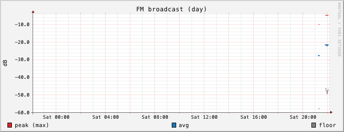

# Operations

## Running unattended on macOS

rfmon has no daemon mode of its own. On macOS, a launchd user agent can start
it at login and restart it if it crashes.

The plist below is an example to adapt, not a tested install script. Replace
every `/path/to/...` value:

- `/path/to/bin/rfmon`: the rfmon binary. After `go install`, `command -v rfmon`
  prints its path if `$(go env GOPATH)/bin` is in your `PATH`.
- `/path/to/rfmon-home`: a directory that holds the data and logs. Create it
  first. launchd does not create the working directory or log directories.
  macOS privacy controls can block background processes from reading or
  writing `Desktop`, `Documents`, and `Downloads`, so choose a directory
  outside those.

Save it as `~/Library/LaunchAgents/local.rfmon.plist`:

```xml
<?xml version="1.0" encoding="UTF-8"?>
<!DOCTYPE plist PUBLIC "-//Apple//DTD PLIST 1.0//EN" "http://www.apple.com/DTDs/PropertyList-1.0.dtd">
<plist version="1.0">
<dict>
    <key>Label</key>
    <string>local.rfmon</string>

    <!-- Replace with the output of: command -v rfmon -->
    <key>ProgramArguments</key>
    <array>
        <string>/path/to/bin/rfmon</string>
        <string>-data</string>
        <string>./data</string>
    </array>

    <!-- rfmon resolves -data relative to this directory. It must exist. -->
    <key>WorkingDirectory</key>
    <string>/path/to/rfmon-home</string>

    <!-- launchd starts jobs with a minimal PATH. rfmon needs to find
         hackrf_sweep and rrdtool. /opt/homebrew/bin is Homebrew on Apple
         silicon; /usr/local/bin is Homebrew on Intel. -->
    <key>EnvironmentVariables</key>
    <dict>
        <key>PATH</key>
        <string>/opt/homebrew/bin:/usr/local/bin:/usr/bin:/bin</string>
    </dict>

    <key>RunAtLoad</key>
    <true/>

    <!-- Restart after a crash or a startup failure (non-zero exit), but not
         after a clean stop. -->
    <key>KeepAlive</key>
    <dict>
        <key>SuccessfulExit</key>
        <false/>
    </dict>

    <key>StandardOutPath</key>
    <string>/path/to/rfmon-home/rfmon.out.log</string>
    <key>StandardErrorPath</key>
    <string>/path/to/rfmon-home/rfmon.log</string>
</dict>
</plist>
```

Check the syntax:

```sh
plutil -lint ~/Library/LaunchAgents/local.rfmon.plist
```

Load it now (it also loads automatically at every login):

```sh
launchctl bootstrap gui/$(id -u) ~/Library/LaunchAgents/local.rfmon.plist
```

Check its state, PID, and last exit status:

```sh
launchctl print gui/$(id -u)/local.rfmon
```

Restart it, for example after installing a new build:

```sh
launchctl kickstart -k gui/$(id -u)/local.rfmon
```

Stop and unload it:

```sh
launchctl bootout gui/$(id -u)/local.rfmon
```

`bootout` sends SIGTERM, rfmon shuts down cleanly and exits with status 0,
and launchd does not restart it. It starts again at the next login, or when
you run `bootstrap` again. To stop it permanently, `bootout` it and delete
the plist.

With `KeepAlive` set to restart only on a non-zero exit, a startup failure
(for example the port is already in use, or `rrdtool` is not in the job's
`PATH`) makes launchd retry it repeatedly. Check `rfmon.log` if
`launchctl print` shows a non-zero last exit code.

A HackRF that is missing or unplugged does not stop rfmon. Polls fail and are
logged until the device comes back.

## Logs

rfmon writes all log output to stderr using Go's standard logger, one line
per event with a local date and time prefix. It writes nothing to stdout.
When run from a terminal, the log appears there. Under the launchd example,
it goes to `rfmon.log` in the working directory.

Normal operation produces one `poll ok` line per poll, under 100 KB of log
per day. rfmon does not rotate its log.

| Line | Meaning |
|---|---|
| `rfmon: graphs at http://127.0.0.1:8080, data in ./data` | Started. The web server is listening. |
| `poll ok: 25200 bins, 43 bands, 4.875s` | A full sweep was recorded. The band count is the number of RRD files updated. |
| `poll failed: ...` | Nothing was recorded for this poll. See troubleshooting below. |
| `rrd <slug>: ...` | One band's RRD update failed. Other bands were still written. |
| `spectrum: ...` or `spectrum prune: ...` | The snapshot write or cleanup failed. |
| `web: graph <file>: ...` | A graph could not be rendered. The browser received HTTP 500. |
| `rfmon: stopped` | Clean shutdown after SIGINT or SIGTERM. |

## Disk use

Measured with the default flags:

| Path | Size |
|---|---|
| `data/rrd/` | 43 files of 1,198,128 bytes each, about 51 MB. Allocated when each band first records and never grows. |
| `data/spectrum/*.bin.gz` | About 17 KB per poll. Roughly 20 to 25 MB per day at one poll every 65 s, about 170 MB once 7 days are retained. |
| `data/spectrum/bins.json` | About 270 KB, fixed. |

A shorter `-pause` means more polls per day and proportionally more snapshot
data. RRD size does not change. Snapshot files older than 7 days are deleted
automatically. RRD files are never deleted by rfmon. To discard history for
one band, stop rfmon and delete `data/rrd/<slug>.rrd`.

## Troubleshooting

### HackRF not found or busy

Every poll logs:

```
poll failed: hackrf_sweep: exit status <n>: <last line of hackrf_sweep stderr>
```

rfmon keeps only the last line of `hackrf_sweep`'s error output. To see the
full message, stop rfmon and run:

```sh
hackrf_info
```

- If no device is listed, check the cable and USB port. `hackrf_sweep`
  reports this as `hackrf_open() failed: HackRF not found (-5)`.
- If the device is listed by `hackrf_info` but rfmon cannot open it while it
  runs, another program has it open. Only one process can use a HackRF at a
  time, and that includes a second copy of rfmon. Find other SDR programs with
  `pgrep -l hackrf` or check what else you have running, and stop them.
- Check the firmware version printed by `hackrf_info` (`Firmware Version:`)
  against the `hackrf_info version:` line. rfmon was tested with firmware
  2026.01.3 and host tools 2026.01.3. Other combinations have not been
  tested.

### `poll failed: got N bins, want 25200`

The sweep ran but returned fewer frequency bins than a full 1 MHz to 6 GHz
sweep. Usually the USB link dropped out or the device was unplugged
mid-sweep. rfmon discards the poll and tries again after the pause. An
occasional one is harmless. If it happens on most polls, treat it as a USB
problem (see below).

### `rrdtool not found in PATH` or `hackrf_sweep not found in PATH`

rfmon exits at startup if either tool is missing:

```sh
brew install hackrf rrdtool
```

If both are installed and rfmon still fails under launchd, the job's `PATH`
does not include the Homebrew `bin` directory. Set `PATH` in the plist's
`EnvironmentVariables`. `command -v rrdtool hackrf_sweep` shows where the
tools are.

### Port 8080 already in use

rfmon exits at startup with:

```
listen tcp 127.0.0.1:8080: bind: address already in use
```

Find the other listener:

```sh
lsof -nP -iTCP:8080 -sTCP:LISTEN
```

Stop it, or run rfmon on another port, for example `-listen 127.0.0.1:8081`.

On macOS, a program listening on all interfaces (`*:8080`) does not prevent
rfmon from binding `127.0.0.1:8080`. Both start, and requests to
http://127.0.0.1:8080 reach rfmon. If a page at that address does not look
like rfmon, check `lsof` as above.

### Graphs are blank or broken

- Before the first successful poll there are no RRD files, so graph requests
  fail with HTTP 500 and the log shows
  `web: graph <slug>-day.png: rrdtool graph: exit status 1: ERROR: opening '...': No such file or directory`.
  This clears after the first `poll ok`. Failed renders are not cached.
- After the first polls, the day graph shows data only as a short segment at
  its right edge, because one day is drawn across 600 pixels. This is the web
  UI's FM broadcast day graph about 15 minutes into a run (the separate marks
  to the left are from an earlier short run):

  
 Week, month, and
  year graphs use consolidated rows, and each row needs more than half of its
  interval covered before it has a value, so they stay empty longer.
- Gaps in a graph are periods with no successful poll for more than 180
  seconds: rfmon was stopped, the HackRF was unavailable, or polls failed.
- If only one band is empty, check the log for `rrd <slug>:` errors.

### USB hubs and dropped samples

`hackrf_sweep` streams at a 20 MHz sample rate. Through a shared USB 2.0 hub,
such as the hub built into many USB-C adapters, the HackRF can drop samples.
Symptoms in rfmon are frequent `got N bins` failures, `hackrf_sweep` errors
in `poll failed` lines, or poll times well above the usual 5 seconds.
`hackrf_sweep` prints `Couldn't transfer any data for one second.` when the
stream stalls, but rfmon only shows that if it is the last line of a failed
run.

The measurements in these docs were taken with the HackRF behind a USB-C hub,
where polls completed normally. If you see the symptoms above, connect the
HackRF directly to a port on the computer. To test throughput, stop rfmon and
run a 10 second receive at 20 Msps. It prints a line each second with the MB
per second transferred, which should stay near 40 MB/second (20 Msps of 8-bit
I and Q samples):

```sh
hackrf_transfer -r /dev/null -f 100000000 -s 20000000 -n 200000000
```

## Using other HackRF tools

rfmon holds the HackRF for the length of every sweep, and starts a new one
after each pause, so other programs will fail to open the device or fail
intermittently while it runs. Stop rfmon first:

- In a terminal: Ctrl-C.
- Under launchd: `launchctl bootout gui/$(id -u)/local.rfmon`.

Wait for `rfmon: stopped` in the log, then use `hackrf_info`,
`hackrf_transfer`, `hackrf_sweep`, or other SDR software. Start rfmon again
afterwards. The graphs show a gap for the time it was stopped.
